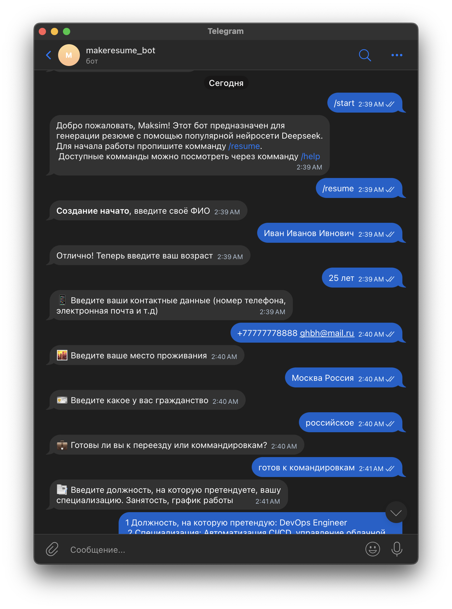
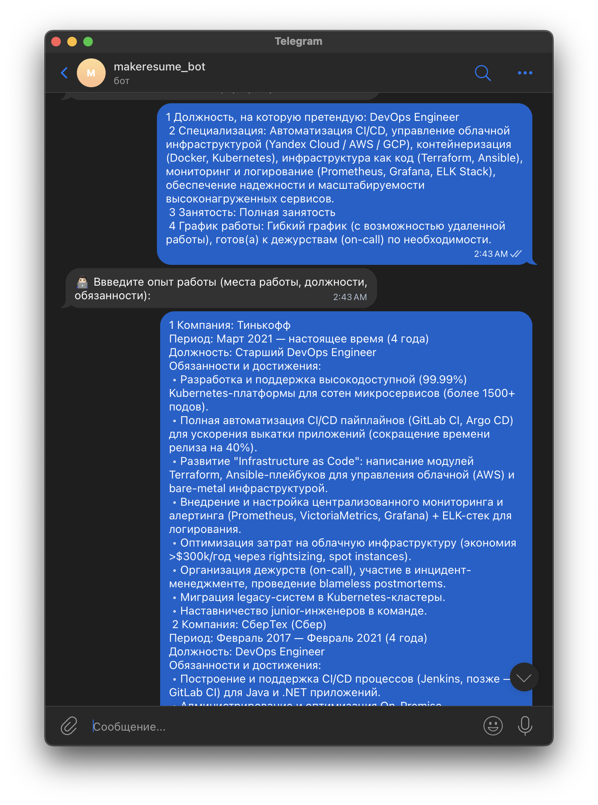
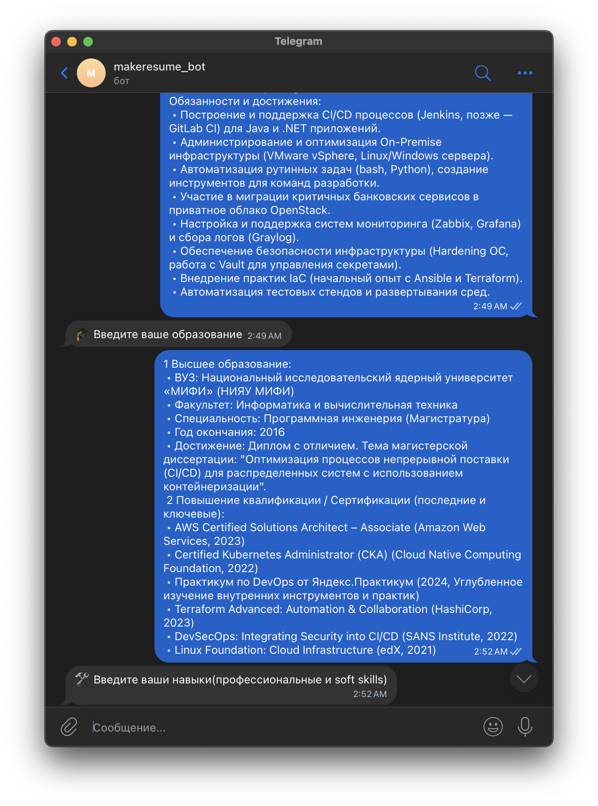

# Resume Generator Bot 🤖

Бот для создания профессиональных резюме с использованием нейросети DeepSeek. Пользователь поэтапно вводит информацию о себе, после чего бот генерирует структурированное резюме в формате Markdown и конвертирует его в PDF.

## Ключевые функции ✨

- **Пошаговый сбор данных** (ФИО, контакты, образование, опыт, навыки)
- **Генерация резюме** с помощью нейросети DeepSeek V3
- **Преобразование в PDF** с кастомными шрифтами
- **Просмотр и редактирование** сгенерированного резюме
- **Асинхронная обработка** задач через Celery и Redis
- **Сохранение состояния** пользователя между сессиями

## Технологический стек 🛠️

- **Backend**: Python 3.12
- **AI**: DeepSeek-V3-0324 (через Azure Inference API)
- **Библиотеки**: 
  - Aiogram (Telegram бот)
  - Celery (асинхронные задачи)
  - Redis (кеширование и брокер)
  - FPDF2 (генерация PDF)
  - Pydantic (валидация конфигурации)

## Как это работает 🚀

1. Пользователь запускает бота командой `/resume`
2. Бот последовательно запрашивает:
   - ФИО
   - Контактные данные
   - Образование
   - Опыт работы
   - Навыки
   - Дополнительную информацию
3. Данные сохраняются в Redis
4. Запускается асинхронная задача генерации через DeepSeek
5. Пользователь просматривает и подтверждает резюме
6. Бот генерирует PDF с кастомными шрифтами
7. Готовое резюме отправляется пользователю

## Особенности реализации 💡

1. **Асинхронная архитектура**:
   - Celery для фоновой генерации
   - Redis как брокер сообщений и кеш
   - Сохранение task_id для отслеживания статуса

2. **Кастомизация PDF**:
   - Использование шрифтов SF Compact
   - Поддержка жирного/курсивного текста
   - Оптимизированная разметка через Markdown

3. **Безопасность**:
   - Валидация конфигурации через Pydantic
   - Хранение чувствительных данных в .env
   - Изоляция Docker-контейнеров

4. **Пользовательский опыт**:
   - Пошаговый FSM (Finite State Machine)
   - Предпросмотр резюме перед генерацией PDF
   - Возможность редактирования

## Установка и запуск ⚙️

1. Склонируйте репозиторий:
```bash
git clone https://github.com/yourusername/resume-bot.git
```
2. Создайте .env файл с следующими переменными:
```.env
BOT_TOKEN=your_telegram_bot_token
GITHUB_TOKEN=your_github_api_token
```
3. Соберите проект с помощью docker-compose
```bash
docker-compose up --build
```

## Комманды бота ⌨️
/start - Запуск бота
/help - справка по коммандам
/resume - начало генерации
/cancel - Отмена генерации

## Пример использования 



